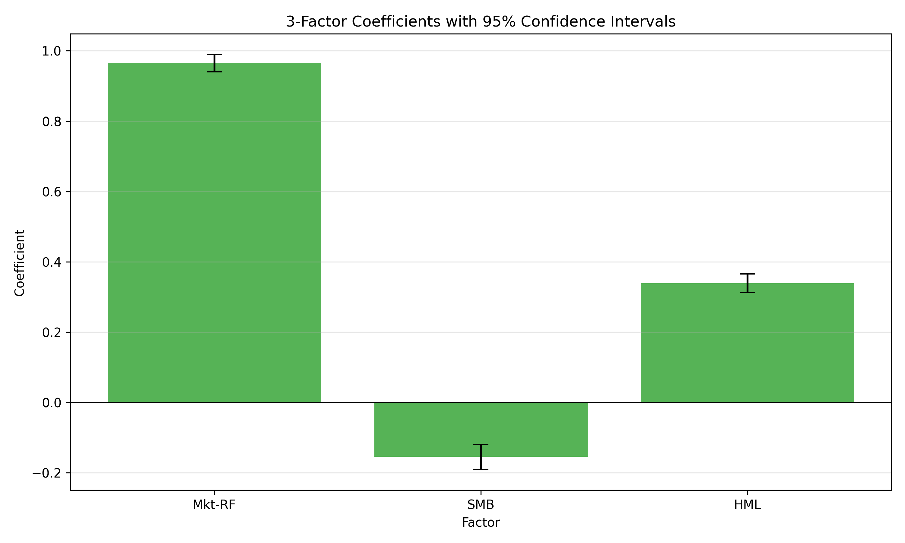
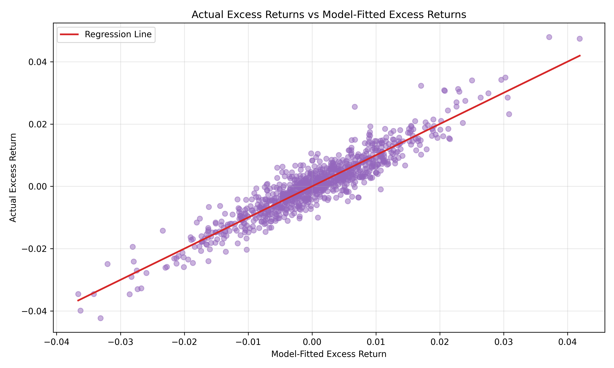
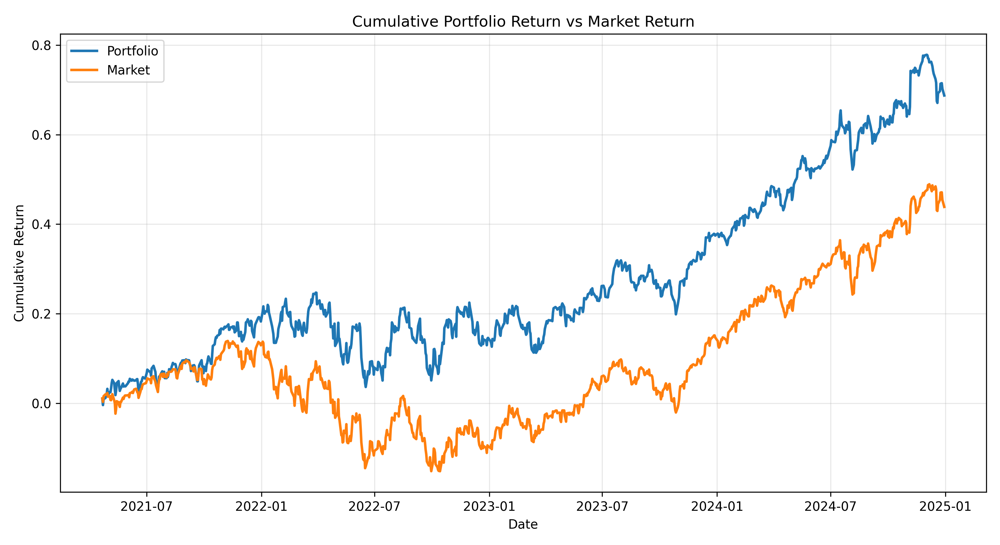
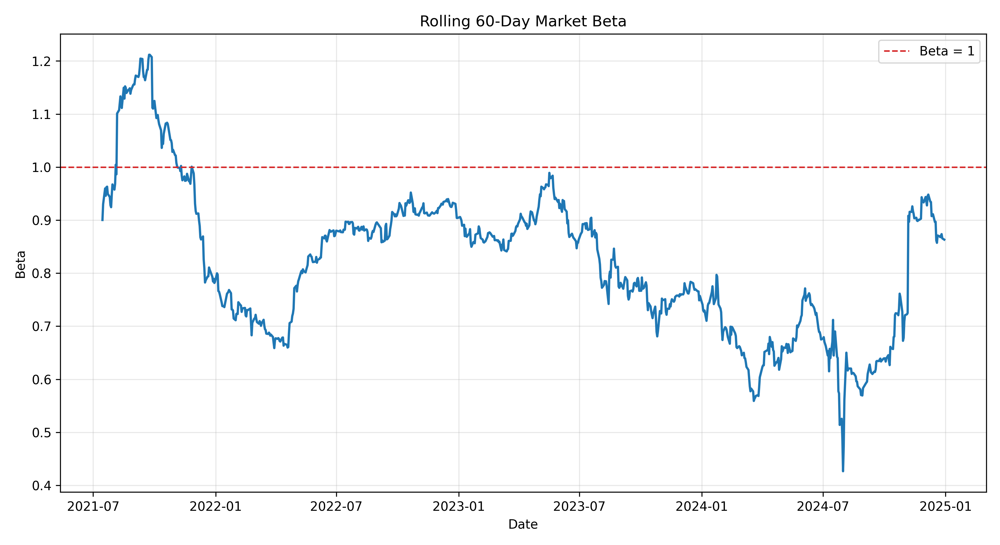

# Fama-French Factor Model Analysis

## The Objective
A Python-based financial model that runs Fama-French 3-Factor and 5-Factor OLS regressions on an equity portfolio to determine its underlying exposure to market risk, size premiums, and value premiums, isolating true alpha from structural factor returns.

## The Factors (Plain English)
* **Market Risk (Mkt-RF):** The portfolio's sensitivity to the broader equity market (Beta).
* **Size (SMB - Small Minus Big):** The historic excess return of small-cap equities over large-cap equities.
* **Value (HML - High Minus Low):** The historic excess return of value stocks (high book-to-market ratio) over growth stocks.

## Visual Analytics

### 1. Factor Exposure (Loadings)
This bar chart visualizes the OLS regression coefficients with 95% confidence intervals, clearly demonstrating the portfolio's large-cap and value tilts.

### 2. Model Accuracy (Actual vs. Fitted)
A scatter plot of actual excess returns versus the model-fitted excess returns. The tight clustering along the regression line visually reinforces the high explanatory power (R-squared = 0.8698) of the 3-Factor model for this specific portfolio.

### 3. Historical Performance
The cumulative return of the analyzed portfolio compared against the broader market over the observation period. 

## Interpretation of Sample Portfolio Backtest
Based on a 930-day historical backtest, the 3-Factor regression model successfully explained ~87% of the portfolio's variance (R-squared = 0.8698). 

* **Market Exposure (Mkt-RF = 0.965):** The portfolio moves almost perfectly in sync with the broader market. It is not structurally market-neutral.
* **Size Exposure (SMB = -0.155):** The negative coefficient indicates a definitive large-cap bias. The portfolio structurally underweights small-cap equities.
* **Value Exposure (HML = 0.339):** The positive coefficient reveals a strong, statistically significant tilt toward value stocks over growth stocks. 
* **Alpha Analysis:** The portfolio's daily alpha (0.000089) has a p-value of 0.467, meaning it is not statistically significant. This is an expected and positive result for this specific asset mix: it proves that the portfolio's returns are entirely explained by its exposure to the market, large-cap, and value factors, rather than unexplained idiosyncratic manager skill.

**Note on the 5-Factor Extension:** Running the portfolio through the Fama-French 5-Factor model (adding Profitability and Investment factors) only increased the R-squared by 0.002. Because the explanatory power gained was negligible, the 3-Factor model remains the most efficient lens for analyzing this specific portfolio.

## Limitations and Dynamic Risk

* **The Flaw of Static Betas:** Standard OLS regressions assume factor loadings remain constant over the entire observation period. As visualized below in the Rolling 60-Day Market Beta chart, the portfolio's actual sensitivity to the market fluctuated heavily between 0.4 and 1.2. The static beta of 0.965 from the summary output masks these significant regime shifts.

* **Survivorship Bias:** The underlying historical data may be subject to survivorship bias depending on the portfolio constituents selected.
* **Missing Factors:** While the 5-Factor model addresses profitability and investment, this analysis does not currently account for Momentum (UMD), which can be a significant driver of short-term excess returns.

## Usage
1. Clone the repository.
2. Install dependencies: `pip install -r requirements.txt`
3. Execute the model: `python src/fama_french_model.py`
